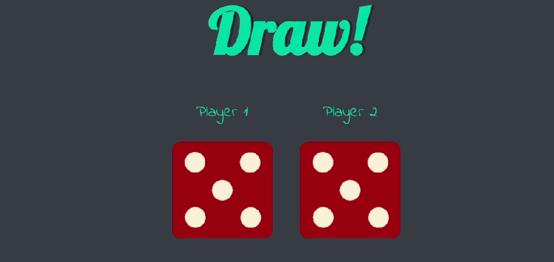
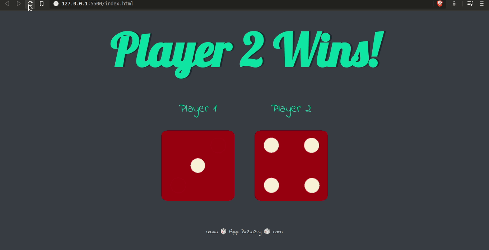

	
		

	<h1>Dice Game 🎲</h1>	

	
	<a href="https://github.com/felipejsborges/web_development_bootcamp_projects">Back to all projects</a>

### What is? 🤔
It's a **gaming website** with two dices. When you **refresh the page**, they are rolled and one of them wins or draws. We created it to practice DOM manipulation with javascript.

### Which technologies were used? 💻
- HTML5
- CSS3
- Javascript

### Want to see how it looks? 📺 

### Wanto to play it? ▶️
Clone [this repo](https://github.com/felipejsborges/web_development_bootcamp_projects), open index.html on your browser, and bet $ 100,00 with your friend, which one wins: Player 1 or Player 2? If draws, pay the $ 100,00 to me 🤑 😂 

by Felipe Borges 
[LinkedIn](https://www.linkedin.com/in/felipejsborges) | [GitHub](https://github.com/felipejsborges)
