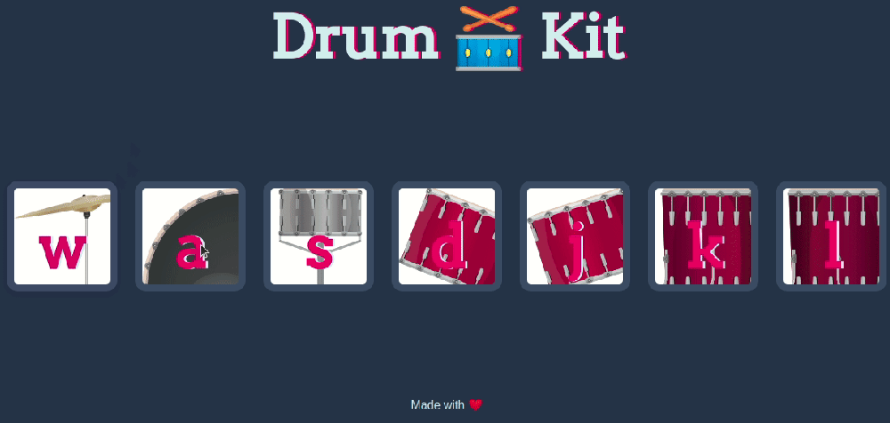
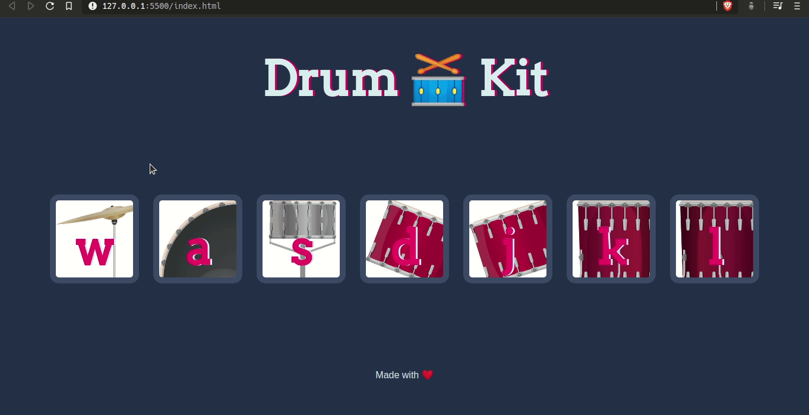

	
		

	<h1>Drum Kit 🥁</h1>	

	
	<a href="https://github.com/felipejsborges/web_development_bootcamp_projects">Back to all projects</a>

### What is? 🤔
It's a **drum kit gaming website**. When you click on a part of the drum (or press the key on keyboard), the **browser plays it sound**. We created it to practice **DOM manipulation** with javascript.

### Which technologies were used? 💻
- HTML5
- CSS3
- Javascript

### Want to see how it looks? 📺 

### Want to play it? ▶️
A gif cannot play sounds. So clone [this repo](https://github.com/felipejsborges/web_development_bootcamp_projects), open drum_kit folder, and open index.html on your browser. Ba Dum Tss! 😛

by Felipe Borges 
[LinkedIn](https://www.linkedin.com/in/felipejsborges) | [GitHub](https://github.com/felipejsborges)
