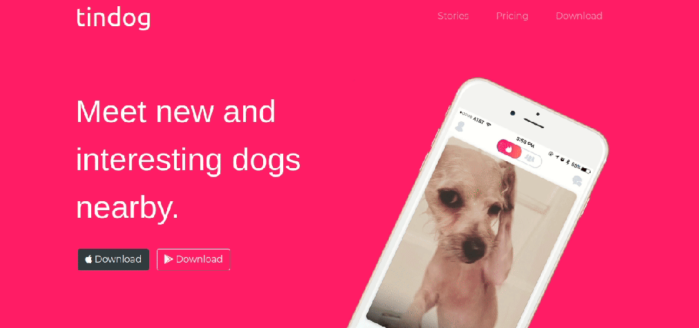
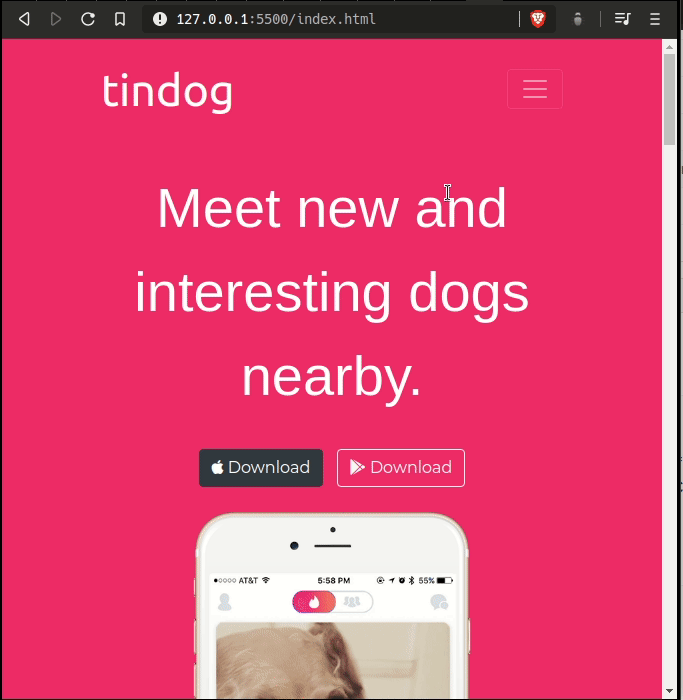

	
		

	<h1>Tindog 💘</h1>
	
	
		<a href="https://github.com/felipejsborges/web_development_bootcamp_projects">Back to all projects</a>
	

### What is? 🤔
It's a **responsive website** based on Tinder, an application to matching people. So we developed **Tindog**, a website where dogs can find their loves 💕🐶.

### Which technologies were used? 💻
- HTML5
- CSS3 + **Bootstrap**

### Want to see how it looks? 📺
In a **desktop or notebook**, Tindog looks like this: 
 

### And on smartphones? 📱
If your dog needs to find his love on **smartphones or tablets**, a non-responsive website cannot disrupt this. So, see how Tindog looks like on your phone: 
 

by Felipe Borges 
[LinkedIn](https://www.linkedin.com/in/felipejsborges) | [GitHub](https://github.com/felipejsborges)
